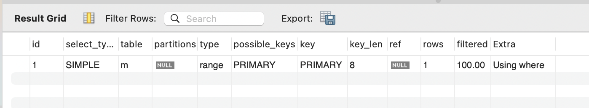

## 커버링 인덱스

일반적으로 인덱스를 설계한다면 `WHERE` 절에 대한 인덱스를 생각하지만,
실제로는 **쿼리 전체**에 대한 인덱스 설계가 필요하다

인덱스를 데이터를 효율적으로 찾는 방법이지만, 
이를 잘 활용한다면 실제 데이터까지 접근 할 필요가 없다.

쿼리를 충족시키는데 필요한 모든 데이터를 가지고 있는 인덱스를 **커버링 인덱스(Covering Index)**라 한다.

## 관련 지식
### 실행 계획 (EXPLAIN)
쿼리의 맨 앞에 `EXPLAIN`을 붙혀 실행하면, 상세한 실행 계획을 확인할 수 있다. 
```sql
EXPLAIN 
SELECT * 
FROM board.member m 
WHERE m.member_id < 10;
```


1. id: SQL문이 실행되는 순서
2. select_type: SELECT 문의 유형
3. key: 옵티마이저가 실제로 선택한 인덱스
4. rows: SQL문을 수행하기 위해 접근한 데이터 행 수
#### extra
  - Using where: WHERE로 필터링 한 경우
  - Using index: 커버링 인덱스를 사용한 경우
  - Using filesort: 데이터를 정렬한 경우

### Non-clustered Key와 Clustered Key
|                   | 대상                                                                        | 제한             |
|-------------------|---------------------------------------------------------------------------|----------------|
| Non-clustered Key | 일반적인 인덱스                                                                  | 테이블에 여러개 생성 가능 |
| Clustered Key     | (1)PK<br/>(2) PK가 없을 땐, Unique Key<br/>(3) 둘 다 없다면, 6bytes의 Hidden Key 생성 | 테이블당 1개만 생성 가능  |

#### 탐색 절차
> Non-clustered Key는 age에 Clustered Key는 PK에 걸려있는 상황


MYSQL에서는 **Non Clustered Key에 Clustered Key가 항상 포함**되어 있습니다.
이유는 Non Clustered Key에는 **데이터 블록의 위치가 없기 때문**인데요.

따라서, 인덱스 조건이 where 검색 조건에 있더라도 Clustered Key 값으로 데이터를 찾는 과정이 필요하다.
>만약 PK를 사용할 경우엔 인덱스 탐색을 하지 않기 때문에 조금 더 빠르게 접근 가능하다.

**커버링 인덱스**는 **실제 데이터에 접근하지 않고 
인덱스의 존재하는 컬럼 값만으로 쿼리를 완성**하는 것을 의미한다.


